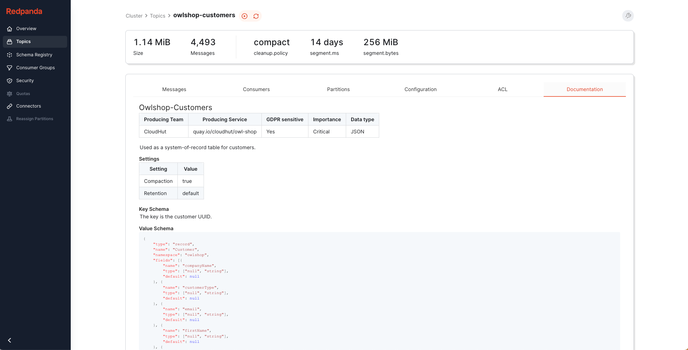

# Topic Documentation

You can embed your topic's documentation into the Redpanda Console user interface by providing access to a GitHub 
repository that hosts your documentation files in Markdown format.



## Integrating topic documentation into Redpanda Console

Redpanda Console clones the provided GitHub repository, recursively iterates through all directories in the 
repository (up to a max depth of 5) and stores all `.md` files it finds in memory. 
The "Documentation" tab in the frontend will show the markdown of the file matching the name of the Kafka topic.

| Path/Filename        | Kafka Topic Name | Matches            |
| -------------------- | ---------------- | ------------------ |
| ordersv2.md          | orders-v2        | :x:                |
| Orders-v2.md         | orders-v2        | :x:                |
| orders-v2.md         | orders-v2        | :white_check_mark: |
| /orders/orders-v2.md | orders-v2        | :white_check_mark: |

## Config

In addition to the repository URL and branch, you usually need to configure authentication credentials so 
that you can access private repositories. Redpanda Console supports SSH as well as basic auth. 
If neither is specified you could still pull publicly accessible repositories.

Following is the configuration:

```yaml
console:
  topicDocumentation:
    enabled: true
    # Git is where the topic documentation can come from, in the future there might be additional
    git:
      enabled: true
      repository:
        url: https://github.com/redpanda-data/redpanda-examples
        branch: main
        baseDirectory: console/topic-documentation 
      # How often Console shall pull the repository to look for new files. Set 0 to disable periodic pulls
      refreshInterval: 1m
      # Basic Auth
      # If you want to use GitHub's personal access tokens use `token` as username and pass the token as password
      basicAuth:
        enabled: false
        username: token
        password: #  This can be set via the via the --owl.topic-documentation.git.basic-auth.password flag as well
      # SSH Auth
      # You can either pass the private key file directly via flag or yaml config or refer to a mounted key file
      ssh:
        enabled: false
        username:
        privateKey: # This can be set via the via the --owl.topic-documentation.git.ssh.private-key flag as well
        privateKeyFilepath:
        passphrase: # This can be set via the via the --owl.topic-documentation.git.ssh.passphrase flag as well
```
